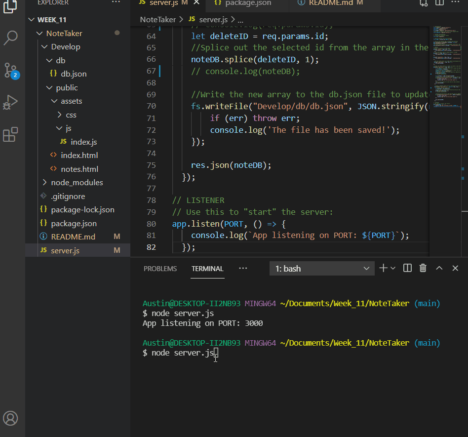

# NoteTaker
 

## Description
The Note Taker allows the user to easily keep track of notes! Add a new note, save it, and when you are done with that note, delete it. Revisit old notes by clicking on their titles. Keep yourself organized and on track with this online note taker. 

## Table of Contents
  - [Description](#description)
  - [Installation](#installation)
  - [Usage](#usage)
  - [License](#license)
  - [Testing](#testing)
  - [Contributions](#contributions)  
  - [Questions and Contact](#questions-and-contact)
  - [Credits](#credits)

## Installation
- To install this application, first clone to repo to your local device.
- Make sure to install node and express.
- Run ***npm init***
- Run ***npm install express***
- Run ***npm install shortid***

The shortid npm package is used to provide each note with a unique id so that it can be removed from your list of notes individually. 

## Usage
This app is used to write, view, and delete notes. Run the app using node in the bash terminal by typing the command ***node server.js***.
A server will begin listening, and you can open the app in your browser.
To stop the server, type in ***ctrl c*** in the terminal and hit enter.

## License
  
  This application is licensed under the MIT license. Please click the link to read more about the license! 
  [License Information](https://choosealicense.com/licenses/mit/)

## Testing
Not available for this application.

## Contributions
:busts_in_silhouette: 
If you wish to contribute, please feel free to open an issue so we can discuss your ideas and develop a plan to move forward!
Pull requests will not be accepted without prior discussion, thank you. 

## Questions and Contact
  :grey_question::grey_question: 
  Please visit my GitHub profile  
  :octocat: https://github.com/aanolan51   
  Feel free to drop me a line!   :fountain_pen: nolana464@gmail.com

## Credits:
1. https://www.youtube.com/watch?v=6iZiqQZBQJY
2. https://nodejs.org/api/fs.html#fs_fs_readfile_path_options_callback
3. https://www.geeksforgeeks.org/node-js-npm-shortid-module/
4. https://expressjs.com/en/guide/routing.html